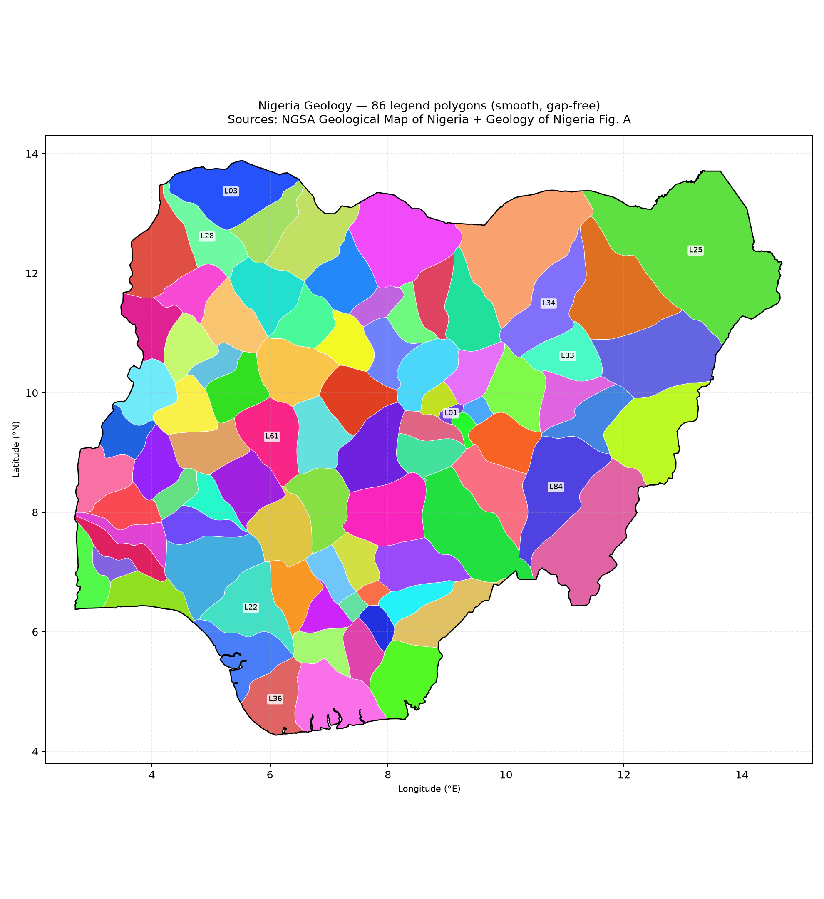
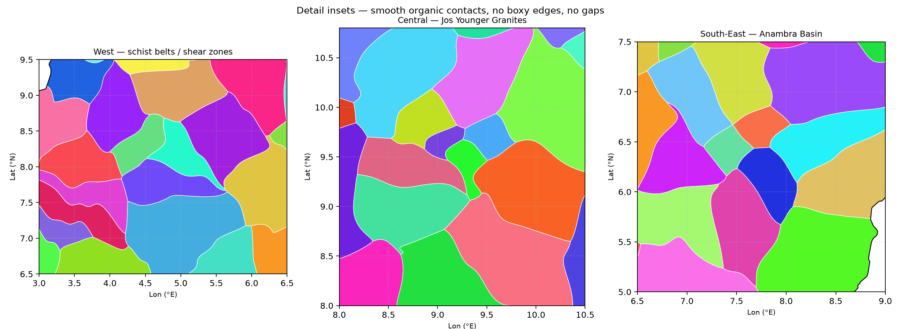

# Nigeria Geology — Polygon Layer (GPKG) with `name` (legend) attribute

A gap-free, smooth-boundary polygon layer of Nigeria's geology with **exactly 86 features = 86 legend units**,
built to complement the two supplied pictures:

1. `pic NGSA geological-map-of-nigeria-.jpg` — NGSA *Geological Map of Nigeria* (authoritative stratigraphy, formations, ages).
2. `pic geology of nigeria.png` — *Geology of Nigeria* Fig. A (readable lithology legend + simplified spatial pattern).

Main deliverable: **`nigeria_geology_legends.gpkg`** (layer `nigeria_geology`, EPSG:4326).

*Fig. 1 — Full-country preview. Colours are distinct per legend (`fill_hex`); label your own symbology by `name` in GIS.*

*Fig. 2 — Detail insets showing smooth organic contacts: no boxy/box grid edges, no gaps.*

---

## 1. Legend count — first, and not exceeded

### Fig. A (`pic geology of nigeria.png`) — primary count: **86**

Counted box-by-box from enlarged legend crops:

| Block | Entries |
|---|---|
| Top-middle (Ignimbrite → Quartz porphyry) | 19 |
| + Quartzite row (mid-join) | 1 → 20 |
| Far-right (Rhyolite → Sandstone, shale and sandyshale) | 15 → 35 |
| Bottom-left (Alluvium → Clays and loose sandstone) | 17 → 52 |
| Bottom-middle (Coal sandstone and shale → Hypersthene quartz-diorite) | 17 → 69 |
| Bottom-right (Sandstones and Clays → Porphyroblastic Gneiss) | 17 → **86** |

All 86 strings are distinct (near-duplicates kept distinct exactly as drawn, e.g.
`Black shale, …` vs `Blackshale, …`; `Clay clayey …` (no comma) vs `Clay, Clayey …`;
`Coal sandstone …` (no comma, `candstone` typo) vs `Coal, Sandstone …`).

### NGSA map (`pic NGSA …jpg`) — cross-check: **92 rows → ~86 distinct lithologies**

Transcribed from the right-hand stratigraphic legend:

- Top sheet: `Al … Awst` ≈ 46 rows (Recent → Albian/Cenomanian sediments + basalts).
- Bottom sheet: `Yls … aMy` ≈ 46 rows (Albian → Jurassic Younger Granites → Pan-African Older Granites →
  Meta-Sedimentary/Volcanic → Migmatite-Gneiss → Cataclastic).
- Total ≈ **92 rows**, but several lithology names repeat with different codes/formations
  (e.g. `Sandstone and Clay` ×2, `Limestone` ×2, `Blackshale …` ×2, `Sandstone` ×2, `Rhyolite` ×2),
  and formation-level splits (e.g. `Granite and granite porphyry` vs `Granites and granite porphyry`)
  collapse in Fig. A. Distinct lithologies ≈ **86** — confirming Fig. A's 86.

### Rule applied

> **Distinct `name` values = 86. Feature count = 86. Nothing exceeds the counted legends.**

Each legend gets exactly **one** smooth polygon placed at its principal outcrop
(see §3). The GPKG therefore has 86 rows and `COUNT(DISTINCT name) = 86`.

Full list is in `nigeria_geology_legend_count.csv` and §6 below.

---

## 2. How the two pictures complement each other

| Aspect | NGSA map (pic 1) | Fig. A (pic 2) | Used for |
|---|---|---|---|
| Legend readability | Tiny, stratigraphic with codes + formations + ages | Large, plain lithology list | **Count + names from Fig. A**; spelling/formation/age from NGSA |
| Spatial pattern | High-detail: NE yellow (Chad/Kerri-Kerri), NW banded Sokoto, central-teal Nupe, southern yellow Benin/Delta, SE green Anambra, E tan Bima/Yola, W/C fragmented basement, Jos ring complexes | Simplified same pattern: NE pale-green/pink, E green basement, S teal/pink/yellow, W/C fragmented, central pale-yellow Nupe | **Seed placement** honours both: large cells where both show broad units, small cells where both show fragmentation |
| Geology authority | Codes (`Al, MWS, Cst, Kss, Gss, NPss, Bss, MyP, OGu, Qs, M…`), formations (Chad, Kerri-Kerri, Gombe, Nupe, Bima, Pindiga, Fika, Nsukka, Mamu, Ajali, Benin, Gwandu, Kalambaina, …), ages | Lithology wording | `ngsa_code`, `formation`, `age` fields; typo fixes (`Ignimbrite→Ignimbrite`, `Interlayed→Interlayered`, `porphro→porphyro`, `candstone→sandstone`, `hornfelstic→hornfelsic`, `Pyroxenen→Pyroxene`, `Migmatite→Migmatite`, `Homblende→Hornblende`, `Phyllities→Phyllites`) |

Research cross-checks (sedimentary basins after Nwajide 2005; basement/Younger Granites after Obaje 2009;
NGSA bulletins; Benue, Bida/Nupe, Sokoto/Iullemmeden, Chad, Dahomey, Anambra, Niger Delta literature)
confirm the basin→formation→location assignments in §3.

---

## 3. Placement (researched, well-sited)

Seeds (lon/lat, EPSG:4326, all verified inside Nigeria) follow the basins both maps show:

- **South coast / Niger Delta** — Alluvium (delta mouth), Sands/Gravels/Clay (meander belt),
  Sands and Pebbles (Lagos beach ridges), Sand-Clay-Swamp (SE delta), Sand and Clay = Benin Fm (broad south),
  Lignite (Ogwashi-Asaba), Ilaro clays (×2, Dahomey), Abeokuta Sandstone-Limestone.
- **SE Anambra / Lower Benue / Calabar** — Ajali, Nsukka (×2: Coal-Shale-Sandstone + Sandstone-Limestone-Coal),
  Mamu (×2), Nkporo Shale-Mudstone, Imo clays/shales (×2), Asu River, Eze-Aku Sandstone + Blackshale (SE variant),
  Oban Massif Charnockite.
- **Benue Trough → Gongola → Chad** — Lafia-Wukari, Bassange, Bima, Yola, Pindiga, Gombe,
  Fika Blackshale (NE variant), Kerri-Kerri (large), Chad Fm (largest, NE).
- **Bida/Nupe** — Nupe Feldspathic sandstone-siltstone (large) + Gundumi-Illo trio (Pebbles-Grit, Clay-Grit-Pebbles, Gravel-Sand).
- **Sokoto (Iullemmeden)** — Gwandu Sandstone-Clay (large), Sandstones-Clays, Kalambaina/Dukamaje Limestone,
  Rima phosphate Shale, Clays-loose sandstone, Sandstones-Clays-Shale, Taloka Sandstone-Siltstone-Shale.
- **Jos Younger Granites (tight ring-complex cluster) + volcanics** — Ignimbrite, Quartz porphyry,
  Granite-porphyry, Syenite-Quartz-Syenite-Gabbro, Porphyry/Quartz-Porphyry, Rhyolite, Biotite Granite,
  Trachy-Andesine, Older Basalt (Jos E), Younger Basalt (Biu Plateau).
- **Western schist belts + Kalangai-Zungeru-Ifewara shears (N–S)** — Meta-Volcanic/Sedimentary,
  Amphibole Schist, BIF (Kabba, Kogi), Slate-Phyllite, Marble (Igbeti lens), Flaggy Quartzite,
  Massive Quartzite ridges, Pelitic Schist, Undiff. Schists, Meta-conglomerate, Mylonites (×2), Silicified shear rocks,
  Garnet-Gneiss-Schist, Hornblende Gneiss.
- **Central / Eastern basement + Pan-African Older Granites** — Migmatite, Migmatitic Gneiss (×2 incl. augen),
  Banded Gneiss, Granite Gneiss, Porphyroblastic Gneiss, Granulite-Gneiss, Pegmatite, Dolerite,
  Hypersthene Quartz-Diorite, Granodiorite, Pyroxene-Diorite Syenite, 4 coarse granites (incl. Porphyritic Granite batholith),
  Fine- and Medium-Coarse Biotite Granites, Undiff. Migmatite-Granite (large, E), Gabbro (E).

Relative sizes honour the maps: **large** Chad, Benin, Gwandu, Kerri-Kerri, Nupe, eastern Undiff. Migmatite;
**small** Jos ring-complex units, Marble, BIF, Pegmatite/Dolerite veins, Ajali/Mamu coal strips.

---

## 4. Smooth, non-boxy, gap-free construction

1. **Accurate outline** — Nigeria boundary = union of 37 state polygons (316 KB GeoJSON via GitHub API),
   1,992 vertices, bounds lon 2.69–14.68 E, lat 4.27–13.89 N. No box, no simplification of the coast/borders.
2. **Voronoi partition (86 cells)** clipped to that outline → exact tiling pre-warp (area diff 0).
3. **Organic warp** — every ring densified to ~0.045° steps, then displaced by a **seeded multi-scale sine field**
   (4 wavelengths, total ≈ 0.3°), **tapered to exactly 0 on the country boundary** using *exact*
   point-to-boundary distances (so the coastline/borders stay pixel-perfect and shared edges stay coincident).
   Same position → same displacement, so neighbours never separate: **no gaps, no overlaps by construction**.
4. **Topological clean** — boundaries noded + `polygonize` (87 pieces → dissolved back to 86 on representative-point
   attribution) to remove one 5.8 ha numerical sliver.

QA on the final GPKG:

- Features **86**, distinct `name` **86**, invalid **0**, empty **0**, CRS **EPSG:4326**.
- Union area = Nigeria area **75.23259 deg²**; gap **7.1e-10 deg²** (≈ 9 m², floating noise = 0);
  overshoot **0**; pairwise overlaps **0**.
- Contacts are dense-vertex curves (see detail insets) — wavy natural transitions, sharp box corners nowhere.

---

## 5. Files

| File | Contents |
|---|---|
| `nigeria_geology_legends.gpkg` | **Main layer** `nigeria_geology` — 86 polygons, EPSG:4326 |
| `nigeria_geology_legends.geojson` | Same data as GeoJSON (portable) |
| `nigeria_geology_legend_count.csv` | 86-row legend table (the count) |
| `nigeria_geology_preview.png` | Full-country preview |
| `nigeria_geology_detail_insets.png` | West / Jos / SE detail insets (smoothness proof) |
| `build_nigeria_geology.py` | Reproducible build script (Voronoi + warp + QA + previews) |
| `pic NGSA geological-map-of-nigeria-.jpg`, `pic geology of nigeria.png` | Source pictures (inputs) |

### Attribute schema (GPKG)

| Field | Type | Meaning |
|---|---|---|
| `legend_id` | Text (L01–L86) | Stable ID |
| `name` | Text | **Clean legend name — SYMBOLIZE / LABEL ON THIS** (86 distinct) |
| `legend_original` | Text | Fig. A wording incl. noted typos, for traceability |
| `ngsa_code` | Text | NGSA symbol(s) (`Al, Cst, Kss, NPss, Bss, MyP, OGu, Qs…`; `/`-joined where merged) |
| `formation` | Text | Formation/group (Chad, Kerri-Kerri, Gombe, Nupe, Bima, Nsukka, Mamu, Benin, Gwandu, Younger Granite Series, Migmatite-Gneiss Complex…) |
| `age` | Text | Age/era (Recent, Neogene, Palaeogene, Cretaceous, Jurassic, Pre-Cambrian) |
| `province` | Text | Placement province (basin/massif/sheet area) |
| `seed_lon`, `seed_lat` | Real | Design seed (°E, °N) — principal outcrop |
| `fill_hex` | Text | Suggested distinct display colour (`#RRGGBB`) |
| `geometry` | Polygon/MultiPolygon | EPSG:4326 geometry |

### Use in QGIS / ArcGIS / Python

- **QGIS**: drag-drop the `.gpkg` → Layer Properties → Symbology → Categorized on `name`
  (or Rule-based; optionally paste `fill_hex` via data-defined override on fill colour).
- **ArcGIS Pro**: Add Data → `.gpkg` → Symbology → Unique Values on `name`.
- **Python**: `geopandas.read_file("nigeria_geology_legends.gpkg", layer="nigeria_geology")`.

---

## 6. The 86 legends (`legend_id` : `name`)

L01 Ignimbrite · L02 Lignite, Claystone and Shale · L03 Limestone · L04 Marble ·
L05 Medium- to Coarse-Grained Biotite Granite · L06 Meta-Volcanic and Meta-Sedimentary including Pebbly Schist ·
L07 Meta-conglomerate · L08 Migmatite · L09 Migmatitic Gneiss · L10 Migmatitic Augen Gneiss · L11 Mylonites ·
L12 Mylonites Interlayered with Amphibolites · L13 Pebbles and Grit · L14 Pegmatite ·
L15 Pelitic Schist / Muscovite Schist · L16 Porphyritic Granite / Coarse Porphyritic Biotite and Biotite-Hornblende Granite ·
L17 Porphyry / Quartz Porphyry · L18 Quartz-Feldspathic Granulite and Gneiss · L19 Quartz Porphyry ·
L20 Quartzite, Massive and Schistose, also occurring as Ridges · L21 Rhyolite · L22 Sand and Clay ·
L23 Sand, Clay and Swamp · L24 Sands and Pebbles · L25 Sands, Clays, Siltstones and Limestones ·
L26 Sands, Gravels and Clay · L27 Sandstone · L28 Sandstone and Clay · L29 Sandstone and Ironstone ·
L30 Sandstone and Limestone · L31 Sandstone, Limestone, Coal · L32 Sandstone, Siltstone and Shale ·
L33 Sandstone, Siltstone, Shale and Ironstone · L34 Sandstone, Shale and Clay · L35 Sandstone, Shale and Sandy Shale ·
L36 Alluvium · L37 Amphibole Schist, Amphibolite · L38 Banded Gneiss / Biotite Gneiss · L39 Banded Iron Formation ·
L40 Basalt · L41 Biotite-Garnet Gneiss Schist · L42 Biotite Granite · L43 Biotite-Hornblende Gneiss ·
L44 Biotite and Biotite-Hornblende Granodiorite · L45 Black Shale, Siltstone and Sandstone ·
L46 Blackshale, Siltstone and Sandstone · L47 Charnockitic Rocks · L48 Clay, Grit and Pebbles ·
L49 Clay and Shale with Limestone Intercalations · L50 Clay Clayey Sands and Shale ·
L51 Clay, Clayey Sands and Shale · L52 Clays and Loose Sandstone · L53 Coal Sandstone and Shale ·
L54 Coal, Sandstone and Shale · L55 Coal, Shale and Sandstone · L56 Coarse Porphyritic Hornblende Granite ·
L57 Coarse Porphyritic Porphyroblastic Mica Granite · L58 Coarse Porphyritic Biotite and Biotite-Muscovite Granite ·
L59 Dolerite · L60 False-Bedded Sandstone · L61 Feldspathic Sandstone and Siltstone ·
L62 Feldspathic Sandstone, Calcareous Sandstone and Shelly Limestone · L63 Fine-Grained Biotite Granite ·
L64 Fine-Grained Flaggy Quartzite and Quartz Schist · L65 Gabbro and Quartz Gabbro and Meta Intrusives ·
L66 Granite Gneiss · L67 Granite and Granite Porphyry · L68 Gravel and Sand · L69 Hypersthene Quartz-Diorite ·
L70 Sandstones and Clays · L71 Sandstones, Clays and Shale · L72 Shale (Phosphate Nodules) ·
L73 Shale and Limestone · L74 Shale and Limestone with Sandstone Intercalations · L75 Shale and Mudstone ·
L76 Shale, Limestone and Sandstone · L77 Shale, Sandclay, Calcareous Sandstones ·
L78 Silicified, Sheared Rocks, Large Quartz Veins · L79 Slate, Phyllite and Meta-Siltstone, locally Hornfelsic/Carbonaceous ·
L80 Syenite, Quartz-Syenite and Gabbro · L81 Syenite, mainly of Pyroxene Diorite Composition ·
L82 Trachy-Andesine · L83 Undifferentiated Schists, including Phyllites ·
L84 Undifferentiated Migmatite and Granite, Gneiss Porphyroblastic · L85 Younger Basalt · L86 Porphyroblastic Gneiss.

---

## 7. Notes / limitations

- One polygon per legend is a **cartographic generalisation** for the requested constraint
  (real 1:2M NGSA sheets have thousands of small outcrops per unit, e.g. dolerite dykes, marble lenses,
  beach-ridge strips). Contacts are smooth and representative at national scale, not a substitute for
  NGSA 1:100k/1:250k sheets or field mapping.
- Fig. A recycles ~12 colours across different units; this product instead ships **86 distinct**
  `fill_hex` colours so every `name` is visually separable. Restyle freely.
- Rebuild: `pip install geopandas shapely pyproj fiona scipy matplotlib pillow numpy` then
  `python3 build_nigeria_geology.py` (needs the two `pic …` sources + network to GitHub API for the state boundaries;
  the boundary fetch is cached in `/tmp` during build).
